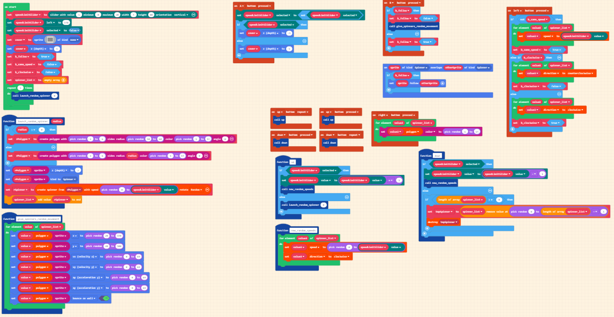

# spinner-toy 

## How to Use Spinner Toy

## Edit this extension

To edit this repository in MakeCode.

* open https://arcade.makecode.com/
* click on **Import** then click on **Import URL**
* paste the repository URL and click import
* the repository URL is https://github.com/WeCodeMakeCode/spinner-toy
* the repository URL is the URL of the main page of the repository

## Blocks Code

## Blocks preview
NOTE: this preview is not updating properly.

This image shows the blocks code from the last commit in master.
This image may take a few minutes to refresh.

## Uses the polygon extension
Spinner Toy uses the polygon extension, which is included when the program is imported into MakeCode Arcade. It's GitHub URL is https://github.com/WeCodeMakeCode/polygon-ext

## Supported targets

* for PXT/arcade
* for PXT/arcade
(The metadata above is needed for package search.)

